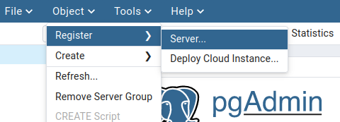
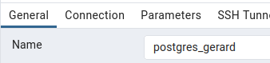

# docker-postgres

## Prerequisitos
Otorgar permisos para ejecutar docker

```
dockerd-rootless-setuptool.sh install
```
## Instalación

Descargar `docker-compose.yml`

# Iniciar servicios
Ir a la carpeta donde está el docker-compose.yml y ejecutar:

```
docker compose up
```

# Uso

Navegar a http://localhost:8080.

## Login  

admin@admin.com / admin


## Conectar al servidor Postgres




